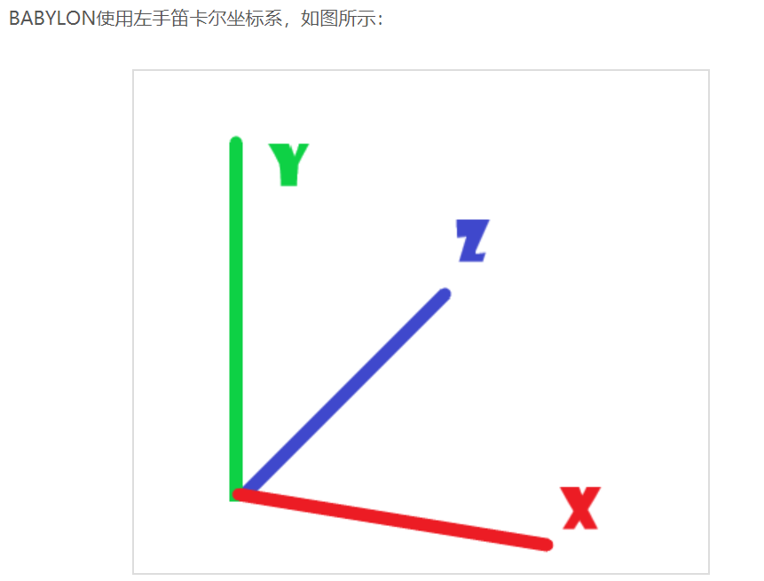

* howler.js--html5 声音引擎

* TweenLite.min.js--js动画库

* babylone.gui--webgl 3D场景生成交互性UI与动态纹理

* 

  

  * https://juejin.im/post/5be9051751882516b9377792
  * https://blog.csdn.net/iefreer/article/details/52782491

---

### babylon

* https://www.babylonjs.com.cn/babylon101/cameras%2C_mesh_collisions_and_gravity.html

* https://docs.microsoft.com/zh-cn/archive/msdn-magazine/2015/december/game-development-babylon-js-building-a-basic-game-for-the-web

* https://doc.babylonjs.com/how_to/

* 相机https://www.babylonjs.com.cn/babylon101/cameras.html
  * 用于第一人称运动的通用相机
  * 用于轨道相机的弧形旋转相机
  * 设备方向设想牛头
  
* 灯光

* 天空盒

   https://doc.babylonjs.com/how_to/skybox

   https://doc.babylonjs.com/resources/playground_textures#cubetextures

* 基本元素https://blog.csdn.net/hahhh11/article/details/80323992

* [babylon.gui](https://www.cnblogs.com/ljzc002/p/7699162.html)

* 材质

   https://www.hellodemos.com/hello-babylonjs/babylonjs-material.html

  https://blog.csdn.net/hahhh11/article/details/80324070

* planehttps://www.babylonjs.com.cn/babylon101/discover.html

* 精灵https://blog.csdn.net/qq_30100043/article/details/88374474

* Window setInterval() 方法https://www.runoob.com/jsref/met-win-setinterval.html

* 动画https://doc.babylonjs.com/babylon101/animations

* textblock https://doc.babylonjs.com/how_to/gui#textblock

* 单选框https://doc.babylonjs.com/how_to/gui#radiobutton

* stack panelhttps://doc.babylonjs.com/how_to/gui3d#stackpanel

---

TODO

- [x] 透明材料之间穿模？？？？？？emmm暂时把地面设成不透明的了
- [x] 分数太丑
- [ ] 按钮太丑
- [ ] 找一个浅色的天空盒
- [ ] 透明材料链接重叠的地方颜色深的问题
- [x] 美化障碍加轮廓emmm阔以放弃吗
- [ ] 特朗普小精灵

